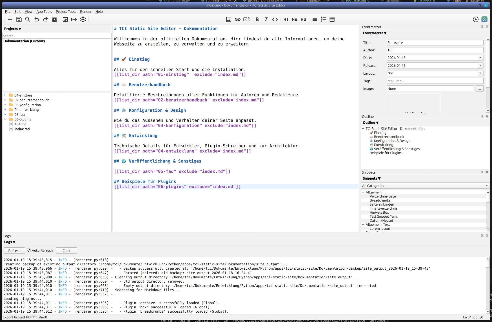

# Siteweave

**Weave your web.** A simple, user-friendly editor for static websites, based on Markdown and Python.

What started as a simple command-line renderer has evolved into a versatile tool for managing static websites. Siteweave provides a user-friendly desktop environment that simplifies the creation of static sites – without sacrificing flexibility or control.

The project is currently in early stages (v0.2) and under active development. It is open to the community: feel free to adapt the code, report issues, or suggest new features. Feedback is always welcome.

## Features

* **Markdown Editor:** Syntax highlighting and live preview.
* **Project Management:** Manage multiple website projects side by side.
* **Integrated Renderer:** Generates static HTML directly from the app.
* **Plugin System:** Extensible via Python scripts (e.g., Gallery, TOC, Obfuscate).
* **Project Tools:** Includes Link Checker, Image Compressor, and Content Backup.
* **Quality Assurance:** Integrated Linter for Markdown and Frontmatter.
* **Bulk Editing:** Edit metadata for multiple files simultaneously.
* **PDF Export:** Create manuals and documentation PDFs from your content.
* **Themes:** Light and Dark Mode support.
* **Multilingualism:** Support for different languages (i18n).
* **Snippets:** Create and reuse text snippets across your pages.
* **Site Templates:** Flexible design with Jinja2 templates.
* **Worker Scripts:** Support for background tasks and automation.



## Roadmap

Ideas planned for future versions:

- Publishing function to deploy sites to GitHub Pages or arbitrary web space.
- Spellchecker for texts.
- More page templates and themes.
- Git integration for version control.
- Additional plugins.
- App installer for Linux, Mac, and Windows.
- Improved documentation.
- Translate all comments to english.


## Documentation and examples

There is a detailed guide for the program in the `documentation` directory.  The documentation also serves as an example of everything that can be done. 

## Installation (for developers)

### Prerequisites

- Python 3.10 or higher
- pip

### Setup

1. Clone the repository:

```bash

git clone https://github.com/YOUR-USERNAME/siteweave.git
cd siteweave

cp app_config_default.yam app_config.yaml

```

2. Create and activate a virtual environment:

```bash
python3 -m venv venv
source venv/bin/activate   # Linux/Mac
# venv\Scripts\activate    # Windows
```

3. Install dependencies:

```bash
pip install -r requirements.txt
```

4. Start the editor:

```bash
python run_editor.py
```

## Contributing

Contributions, bug reports, and feature suggestions are very welcome. Please open an issue or submit a pull request on GitHub.

## License

GNU General Public License, version 3 (GPLv3)
