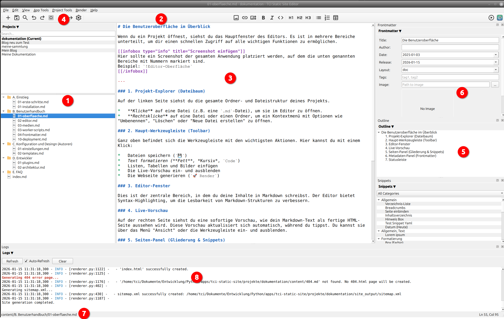

When you open a project, you will see the main window of the editor. It is divided into several areas to give you quick access to all the important functions.

### 1. Project Panel (Manage Projects)

The project panel is located at the top left (above the file tree).

* **Quick Switch:** Shows a list of recently opened projects. Double-clicking immediately switches to the project.
* **Management:** Use the context menu (right-click) to rename projects or remove them from the list.
* **Search:** A search field helps you keep track of multiple projects.

### 2. Project Explorer (file tree)

On the left side, you can see the entire folder and file structure of your project.

* **Click** on a file (e.g., an `.md` file) to open it in the editor.
* **Right-click** on a file or folder to open a context menu with options such as “Rename,” “Delete,” or “Create New File.”

### 3. Main toolbar

At the top is the toolbar with the most important actions. Here you can do the following with a single click:

* Save files
* Format text (**bold**, *italics*, `code`)
* Insert lists, tables, and images
* Show and hide the live preview
* Generate the web page (`Render`)

### 4. Editor window

This is the central area where you write your content in Markdown. The editor offers syntax highlighting to improve the readability of Markdown structures.

### 5. Live preview

On the right-hand side, you will see an instant preview of how your Markdown text will look as a finished HTML page. This preview updates automatically as you type. You can show or hide it via the “View” menu or the toolbar.

### 6. Side Panel (Outline & Snippets)

This panel on the far right offers two useful tabs:

* **Outline:** Shows a clickable overview of all headings (`#`, `##`, etc.) in your current document. Ideal for quickly navigating long texts.
* **Snippets:** A collection of reusable text modules. You can create your own snippets and drag and drop them into your text.

### 7. Metadata Panel (Front Matter)

Below the editor is a form where you can edit the metadata (the “front matter”) of the current page. This includes:

* **Title:** The title of the page.
* **Date:** The publication date.
* **Layout:** The template to be used.
* **Draft:** If this option is enabled, the page will be ignored when generating the website.

### 8. Status bar

At the very bottom of the window, you will find the status bar. It displays useful information such as the file path of the open file, the current line and column number of your cursor, and the word count of the document.

### 9. Log window
 
Log information is displayed here during rendering.