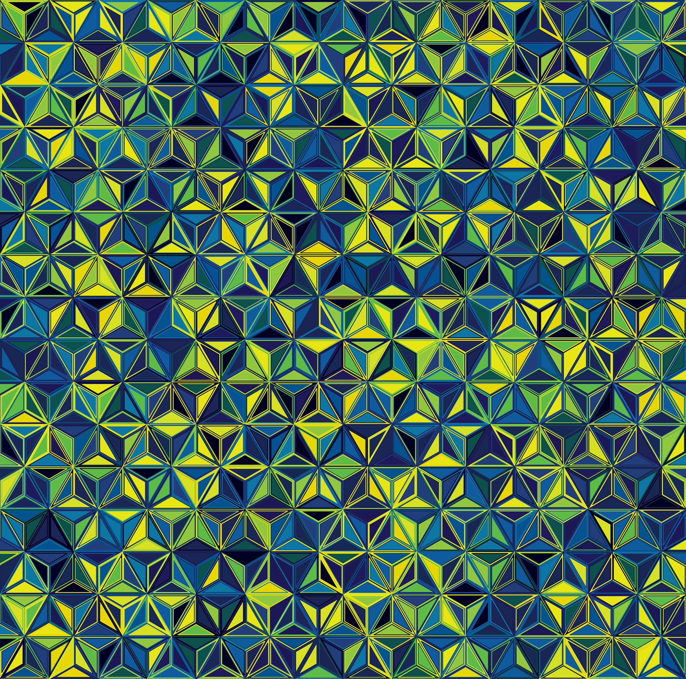

## Beschreibung

Erzeugt eine Bildergalerie mit Lightbox. Verwendet komprimierte Bilder für die Vorschau und verlinkt auf die Originalbilder in der Lightbox.

### Zwei Modi:

#### 1. Aus einem Verzeichnis:

```

[[gallery path="relativer/pfad/zum/ordner" layout="grid" cols="3" ...]]

```

#### 2. Aus Markdown-Bildern im Inhalt:

```

[[gallery layout="grid" cols="3" ...]]
  
  
[[/gallery]]

```

### Parameter:

- layout (str): 'grid' (Standard) oder 'masonry'.
- cols (int): Anzahl der Spalten. Standard: 3.
- ratio (str): Seitenverhältnis der Vorschaubilder. 
    - Mögliche Werte: 'original', '1:1', '4:3', '3:2', '16:9', **Standard: '4:3'**
- gap (str): Abstand zwischen den Bildern (z.B. '1rem', '10px'). Standard: '1rem'.


## Beispiele:

### Galerie mit Standard-Seitenverhältnis

`[[gallery]]`

[[gallery]]





[[/gallery]]


### Zwischentitel
Hier kommt noch etwas Text.

### Galerie mit Quadrat-Seitenverhältnis
`[[gallery ratio="1:1"]]`

[[gallery ratio="1:1"]]


[[/gallery]]


### Galerie mit Masonry-Layout
`[[gallery layout="masonry"]]`

[[gallery layout="masonry"]]


[[/gallery]]


### Blumen Galerie (Directory Listing)

`[[gallery path="assets/blumen" layout="masonry" cols="4"]]`


[[gallery path="assets/blumen" layout="masonry" cols="4"]]